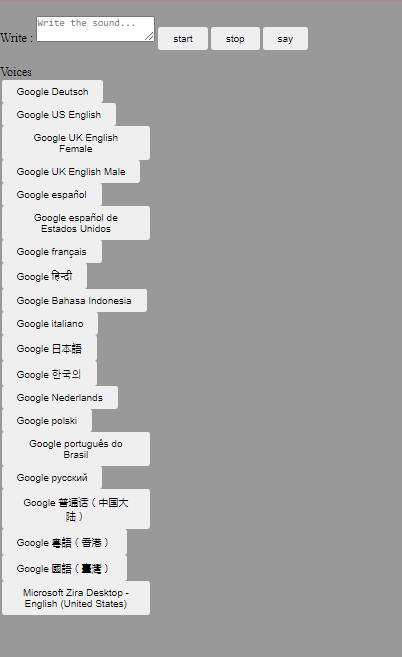

# Voice-Changer
A web application that uses the Google voice api and also has a voice changer that gives your article a voice.
#
- HTML page
- Simple code
- Using the microphone feature in the web browser
- Pure HTML JS CSS
- Leveraging Google voices
- Speaking and writing feature available
- Ease of Use
- Multiple sound options are available.
#
# İmportant!!!
## Google voice feature is used in the script. You can wait when you say a voice on the microphone. To speak, you have to click the voice button, you have to choose each voice option yourself.
#
</img>
## Codpen.io
[Codpen account link](https://codepen.io/oguzhan1881)
## Github Account Link
[Github account link](https://github.com/oguzhan18)
## Mail
oguzhancart1@gmail.com
# Instagram Account Link

